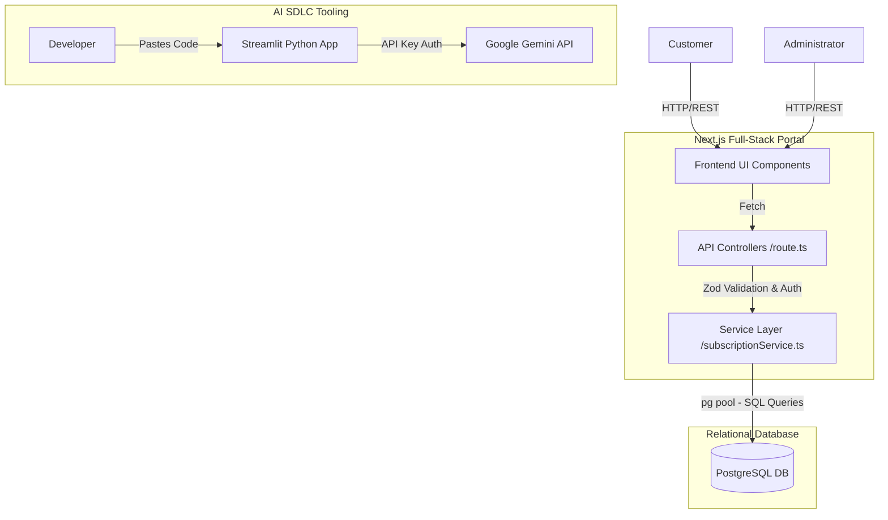

### ⚠ JURY EVALUATION REQUIREMENT: AI GENERATION PROMPT

**The following markdown prompt was used to generate this deliverable via the AI Assistant:**

> **Prompt:**
> Act as a System Architect. Generate Deliverable 2: Application and Technical Architecture Diagrams for our "Telecom Plan Management Portal".
> The architecture must include Next.js for the full-stack portal, PostgreSQL for the relational database, and a standalone Streamlit Python app for the AI Code Quality Agent.
> Provide logical, technical, integration, data flow, security, and AI-assist architecture views as required by the SDLC rubric. Use Mermaid.js to render the visual diagrams.

---

# Deliverable 2: Application and Technical Architecture

## 1. Technical Architecture Stack

The application adopts a modern, decoupled monolithic approach leveraging serverless-ready frameworks and AI integrations:

- **Frontend UI:** Next.js (React 19), Tailwind CSS
- **Backend API:** Next.js App Router API endpoints (`route.ts`)
- **Service Layer:** TypeScript data-access objects isolating DB logic
- **Database Layer:** PostgreSQL (Strict RDBMS implementation)
- **AI Quality Agent:** Python, Streamlit, Google Gemini 1.5 Flash API

## 2. Logical & Integration Architecture

This diagram illustrates the logical separation of concerns between the user-facing portal, the backend services, the relational database, and the offline AI Developer Assistant.

